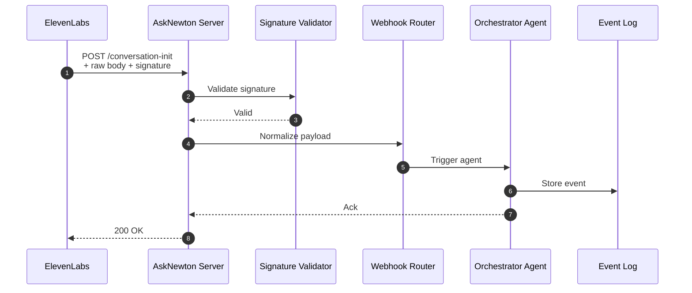

# ElevenLabs Webhooks — Integration Guide

This document provides a complete technical reference for handling ElevenLabs → AskNewton webhook events, including HMAC validation, raw-body handling, routing, normalization, testing, and event storage.

AskNewton currently supports **two** signed webhook events:
- `conversation-init`
- `conversation-end`

Both must be HMAC-validated and idempotent.

---

# 🔊 1. Webhook Endpoints

AskNewton exposes the following endpoints:

```

POST /webhooks/eleven/conversation-init
POST /webhooks/eleven/conversation-end
GET  /healthz
GET  /version
GET  /events

```

### Endpoint purposes:
| Endpoint | Purpose |
|----------|---------|
| `/webhooks/eleven/conversation-init` | Fired when a new voice session starts |
| `/webhooks/eleven/conversation-end`  | Fired when the call finishes |
| `/healthz` | Liveness probe |
| `/version` | Build metadata |
| `/events`  | In-memory event history for debugging |

---

# 🔐 2. Security — HMAC Signature Validation

ElevenLabs sends each webhook with:

```

x-elevenlabs-signature: <HMAC SHA256>

````

### AskNewton recomputes the signature:

```ts
const hmac = crypto
  .createHmac("sha256", secret)
  .update(rawBody)
  .digest("hex");
````

### And compares using **timing-safe compare**:

```ts
crypto.timingSafeEqual(
  Buffer.from(hmac),
  Buffer.from(receivedSignature)
);
```

This prevents:

* spoofing
* replay attacks
* tampered payloads
* timing attacks

If validation fails → **401 Unauthorized** and the event is logged.

---

# 🧱 3. Required Secrets (Replit → Secrets)

| Secret               | For                               |
| -------------------- | --------------------------------- |
| `ELEVEN_INIT_SECRET` | HMAC key for `/conversation-init` |
| `ELEVEN_END_SECRET`  | HMAC key for `/conversation-end`  |

> These secrets must match the values configured inside the ElevenLabs dashboard.

---

# 📦 4. Request Flow Overview



---

# 📥 5. Raw Body Capture (Required)

Express **must** capture the exact raw body using:

```ts
app.use(
  express.raw({
    type: "*/*",
  })
);
```

Only after HMAC verification can JSON parsing occur.

Do NOT change this — HMAC will fail.

---

# 🔁 6. Idempotency Handling

Webhook payloads may contain:

```
id
event_id
conversation_id
```

AskNewton uses these fields to prevent double-processing.

If the same ID arrives twice:

* The event is **ignored**
* Status is still **200 OK**
* A log entry is added for auditing

This prevents event storms and duplicate agent triggers.

---

# 🧩 7. Normalization Layer

Incoming ElevenLabs payloads are normalized into a consistent internal format:

```json
{
  "type": "conversation-init",
  "conversationId": "...",
  "timestamp": 1710000000,
  "metadata": { ... }
}
```

This normalized event is what the Orchestrator consumes.

---

# 🤖 8. Integration with the Orchestrator Agent

After normalization, the event is passed to the orchestrator:

```
conversation-init → Orchestrator → Persona/Memory Manager
conversation-end  → Orchestrator → Summary Agent / CRM Sync
```

Typical logic includes:

* session creation
* load persona models
* classify intent
* CRM enrichment
* call summaries
* debug logging

---

# 🧾 9. Event Logging

`GET /events` returns the recent webhook history, trimmed in-memory.

Stored fields:

* event ID
* timestamp
* endpoint (`init` or `end`)
* HMAC result
* short payload summary

Not stored:

* sensitive content
* audio
* full transcripts
* secrets

> This endpoint is for debugging only.
> **Never expose this in production.**

---

# 🧪 10. Testing Webhooks

## 🔧 10.1 Automatic Tests

Run:

```bash
npm run test:init
npm run test:end
```

Each test script:

* loads sample JSON
* computes HMAC using the correct secret
* POSTs to the webhook endpoint
* validates response

---

## 🧪 10.2 Manual curl Tests

### Conversation-init

```bash
BODY='{"ping":"init"}'
SIG=$(printf "$BODY" | openssl dgst -sha256 -hmac "$ELEVEN_INIT_SECRET" -hex | awk '{print $2}')

curl -X POST "$REPL_HOST/webhooks/eleven/conversation-init" \
  -H "Content-Type: application/json" \
  -H "x-elevenlabs-signature: $SIG" \
  -d "$BODY"
```

### Conversation-end

```bash
BODY='{"ping":"end"}'
SIG=$(printf "$BODY" | openssl dgst -sha256 -hmac "$ELEVEN_END_SECRET" -hex | awk '{print $2}')

curl -X POST "$REPL_HOST/webhooks/eleven/conversation-end" \
  -H "Content-Type: application/json" \
  -H "x-elevenlabs-signature: $SIG" \
  -d "$BODY"
```

Expected:

```json
{ "ok": true }
```

---

# ⚠️ 11. Invalid Payload Testing

### Wrong signature → must return 401

```bash
curl -X POST "$REPL_HOST/webhooks/eleven/conversation-init" \
  -H "x-elevenlabs-signature: WRONG" \
  -d "{}"
```

### Malformed JSON → must return 400

```bash
curl -X POST "$REPL_HOST/webhooks/eleven/conversation-init" \
  -H "Content-Type: application/json" \
  -d '{"incomplete":}'
```

---

# 🧭 12. Troubleshooting

### **HMAC Mismatch**

* Wrong secret?
* Missing raw-body middleware?
* Body changed by logging middleware?
* Trailing newline in curl body?

### **Webhook returns 500**

* JSON parsing before HMAC
* Undefined properties in router layer
* Internal agent errors

### **ElevenLabs retries too often**

* Always ensure a `200` response
* Never block processing on downstream failures

---

# 📌 13. Future Improvements

Planned enhancements:

* Replace in-memory event store with Redis
* Add rate-limiting middleware
* Introduce structured logging (pino)
* Add webhook signature rotation
* Add per-event validation schema
* Integrate test runner into GitHub Actions

---

